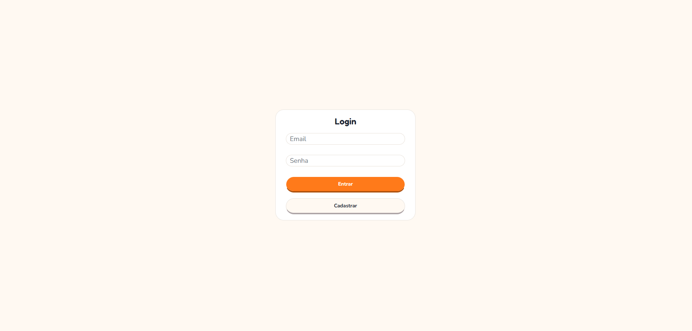

# App Inglês 🇬🇧

Treinador de inglês full-stack com quiz e feedback gerados por IA — a nota é sempre calculada no servidor, a partir do gabarito que está no banco, nunca de dado enviado pelo cliente.

🔗 Demo: https://app-ingles-bay.vercel.app/treino
📦 Repo: https://github.com/Americanoooo/app-ingles


---

## Problema / Motivação

Depois do primeiro projeto de portfólio, eu queria sair da minha zona de conforto num ponto específico: nunca tinha me aprofundado em consumir uma API externa de verdade. IA generativa encaixou perfeitamente nessa meta — dava pra construir algo útil (um treino de inglês) enquanto aprendia, de ponta a ponta, a integrar com um provedor de IA: da chamada ao modelo até validar e persistir com segurança o que ele devolve.

---

## ✨ Funcionalidades

- **Autenticação completa** — cadastro e login com senha criptografada e sessão via cookie httpOnly (proteção contra roubo de token via XSS).

  

- **Autorização por dono (anti-IDOR)** — cada usuário só vê os próprios quizzes; id de outro dono na URL não vaza dado (404 genérico, também anti-enumeração).
- **Rate limiting** — limites por IP nas rotas públicas (login/cadastro) e por usuário nas autenticadas, com contadores independentes para as rotas que chamam a IA (mais caras) e para o restante.
- **Geração de quiz por IA** — escolha de dificuldade e quantidade de perguntas; a IA gera questões de múltipla escolha nas categorias *preposição*, *tempo verbal* e *contexto*.

  

- **Correção no servidor** — o quiz é persistido no momento da geração e corrigido contra o gabarito do banco, dentro de uma transação.
- **Tela de resultado** — acertos destacados visualmente (verde/vermelho), com a resposta correta revelada apenas nas perguntas erradas.

  

- **Feedback por pergunta** — explicação gerada por IA, em português, do porquê da resposta correta.
- **Histórico de quizzes** — relatório com filtros por dificuldade e período; revisão pergunta a pergunta de um quiz antigo.

  

- **Limpeza automática** — rotina agendada diariamente remove quizzes gerados e nunca respondidos, consequência assumida do fluxo de persistir antes de corrigir.

---

## 🛠️ Tecnologias

**Front-end:** Next.js (App Router) · React · TypeScript · Tailwind CSS + shadcn/ui
**Back-end:** Next.js Route Handlers · MySQL (`mysql2`) · Zod · bcrypt · jose (JWT em cookie httpOnly)
**IA:** Google Gemini (endpoint compatível com OpenAI), saída estruturada via `json_schema`
**Infraestrutura:** Docker + Docker Compose · Upstash Redis (rate limiting) · Vercel Cron · Deploy: Vercel (app) + Aiven (MySQL)

---

## 🧠 Destaques de arquitetura

**Falha de segurança que eu encontrei e corrigi: nota forjável pelo cliente.** Na primeira versão, o quiz só era gravado quando o usuário respondia — o que significa que, na hora de corrigir, o `/api/responder` recebia a resposta certa de cada pergunta no mesmo body que o cliente reenviava. O servidor até calculava a nota (o cliente não mandava `acertou: true`), mas comparava **dois valores que o próprio cliente controlava**: bastava abrir o DevTools, ler o gabarito e reenviar `respostaUsuario = respostaCerta` pra forçar 10/10.

A correção mudou o fluxo: `/api/gerar-perguntas` passou a persistir quiz e perguntas (com o gabarito) no momento da geração, dentro de uma transação, e devolve pro front apenas `quizId`, os ids das perguntas, enunciados e opções — a resposta certa nunca sai do servidor. O `/api/responder` recebe só `quizId` e os pares `{perguntaId, respostaUsuario}`, busca o gabarito real no banco com checagem de dono (JOIN por `usuario_id`), calcula acerto e nota, e faz o UPDATE. Nada que o cliente envie participa da decisão do que é certo — e, de quebra, o gabarito deixou de ficar visível no DevTools durante o quiz.

**Trade-off que eu aceitei conscientemente, e o que fiz com ele.** Persistir o quiz antes de existir resposta significa aceitar linhas incompletas no banco: `nota`, `resposta_usuario` e `acertou` nascem nulos e só são preenchidos quando o usuário envia. Além de exigir que essas colunas fossem nullable, isso cria um efeito colateral: quizzes gerados e nunca respondidos ficam guardados. A alternativa (segurar tudo em memória até o envio) manteria o banco limpo, mas não sobrevive a um ambiente serverless, onde a próxima requisição pode cair em outra instância. Escolhi o dado incompleto em vez da falha de segurança, e lidei com as consequências em dois lugares: o relatório filtra por `nota IS NOT NULL`, e uma rotina agendada apaga os abandonados.

**A rotina de limpeza.** É uma rota (`/api/limpeza`) invocada por um Vercel Cron uma vez por dia. Três decisões que valem explicação:

- **Autenticação por segredo compartilhado, não por sessão.** O cron é um robô e não tem cookie, então a rota compara o header `Authorization` com a variável `CRON_SECRET` — e por isso ela também fica de fora do matcher do middleware, que exige sessão. São dois mecanismos de identidade para dois tipos de cliente.
- **Sem transação, de propósito.** A ordem importa (perguntas antes de quiz, por causa da FK), mas uma falha no meio deixa apenas quizzes sem perguntas, que continuam batendo no critério de abandonado e somem na execução seguinte. Falha parcial que se autocorrige não precisa de transação; o `SalvarQuiz`, onde o estado intermediário seria visível para o usuário, precisa.
- **Margem de um dia no critério.** A limpeza só considera abandonado o que é anterior ao dia corrente, para nunca apagar um quiz que alguém está respondendo naquele momento.

**Saída estruturada da IA (`json_schema`).** Resposta de LLM em texto livre é inconsistente na prática — e isso não é só estética: um parse que falha vira bug real na experiência do usuário (quiz não carrega, feedback trava). Por isso a geração das perguntas e o feedback por pergunta usam saída estruturada (`json_schema`, na chamada compatível com OpenAI ao Gemini) — o schema trava os campos que a IA precisa devolver, então o código lê cada um com confiança em vez de tentar adivinhar texto solto. Como camada extra, a resposta ainda passa por validação com Zod antes de qualquer gravação no banco — defesa em profundidade: o schema garante o formato na saída do LLM, o Zod garante que o que chega no back-end bate com o que o banco espera, mesmo que o provedor mude de comportamento.

**Persistência atômica.** Quiz e perguntas precisam ser gravados como uma unidade: se a inserção de uma pergunta falhar no meio do caminho, sobra um quiz órfão no banco. Por isso `SalvarQuiz` e `atualizarRespostas` abrem uma transação (`beginTransaction` → queries → `commit`, com `rollback` no catch e `release` da conexão no `finally`). Todas as queries da transação rodam na **mesma conexão** obtida do pool — se cada uma pegasse uma conexão qualquer, o rollback de uma não teria efeito nenhum sobre o que já rodou em outra.

**Uma convenção de nomes, convertida num lugar só.** O banco usa snake_case e o restante da aplicação usa camelCase. A conversão acontece dentro dos models (`lib/*.model.ts`), logo depois da query: rotas e front nunca veem nome de coluna. Antes disso, uma rota devolvia a linha crua do banco enquanto outras já convertiam, e o mesmo dado chegava com dois formatos diferentes dependendo da tela — origem de vários bugs silenciosos, porque o TypeScript não acusa quando a interface descreve um formato que o dado real não tem.

**Erro tratado por camada.** O model lança, a rota traduz para HTTP e o front exibe. As funções em `lib/respostas.ts` concentram os status e as mensagens voltadas ao usuário; o detalhe técnico vai só para o log. No cliente, o `apiFetch` converte qualquer resposta com status de erro em um `ApiError` que carrega status e mensagem, e a tela usa `instanceof` para distinguir "o servidor respondeu com erro" de "a requisição nem chegou lá" — só no primeiro caso a mensagem do backend é exibida. No middleware, a mesma ideia separa o que é falha de autenticação (bloqueia) do que é falha de infraestrutura do rate limit (registra no log e deixa passar).

---

## 🚀 Como rodar

### Opção 1 — Docker (recomendado)

**Pré-requisitos:** Docker instalado.

```bash
git clone https://github.com/Americanoooo/app-ingles.git
cd app-ingles
# crie o .env (veja "Variáveis de ambiente")
docker compose up --build
```

Acesse http://localhost:3000 — o schema do banco é criado automaticamente na primeira execução.

### Opção 2 — Local

**Pré-requisitos:** Node.js, MySQL local com o schema criado (`schema.sql`).

```bash
npm install
# configure o .env apontando pro seu MySQL local
npm run dev
```

## 🔑 Variáveis de ambiente

```env
DB_HOST=localhost          # use "db" ao rodar via Docker Compose
DB_USER=root
DB_PASSWORD=sua_senha
DB_NAME=app_ingles
DB_PORT=3306
JWT_SECRET=uma_chave_secreta_longa
GEMINI_API_KEY=sua_chave_do_gemini
UPSTASH_REDIS_REST_URL=url_do_seu_redis
UPSTASH_REDIS_REST_TOKEN=token_do_seu_redis
CRON_SECRET=string_aleatoria_longa   # autentica a rota de limpeza
```

> O `.env` está no `.gitignore` e não é versionado. A chave do Gemini é gratuita no Google AI Studio.

---

## 📁 Estrutura

```
app/
├── (auth)/          # login/cadastro (público)
├── (app)/           # treino, relatório (autenticado) + layout com Navbar
├── api/              # route handlers
components/
├── ui/               # shadcn/ui
lib/                  # models, conexão com o banco, helpers
schema.sql            # estrutura do banco
vercel.json           # agendamento do cron de limpeza
docker-compose.yml
dockerfile
```

---

## 🗺️ Roadmap

- **Modo adaptativo** — gerar perguntas focadas nas categorias que o usuário mais erra, lendo o histórico de acertos.
- **`data` como DATETIME** — hoje a coluna guarda só o dia, o que limita a ordenação do histórico e a granularidade da limpeza a intervalos de 24h.

---

## Autor

**Cauã Americano** — [GitHub](https://github.com/Americanoooo) · [LinkedIn](https://www.linkedin.com/in/cau%C3%A3-americano-19a4012a5/)

---

## English summary

Full-stack English trainer with AI-generated quizzes and per-question feedback (Next.js App Router, TypeScript, MySQL). The server is the single source of truth for scoring: quizzes and questions — including the correct answers — are persisted when the quiz is generated, and `/api/responder` grades submissions against the database instead of trusting anything the client sends back. This closed a real vulnerability in v1, where the answer key round-tripped through the client and a forged 10/10 was possible from DevTools. The accepted trade-off — rows that start incomplete, and abandoned quizzes that pile up — is handled by a daily Vercel Cron cleanup route, authenticated by a shared secret rather than by session. Questions and feedback come from Google Gemini (OpenAI-compatible endpoint) using structured output (`json_schema`), validated again with Zod before reaching the database. Writes run inside a single DB transaction on one pooled connection. Session auth via httpOnly cookie (`jose`); ownership-based authorization prevents IDOR across users' quiz history; rate limiting is applied per IP on public routes and per user on authenticated ones.

Demo: https://app-ingles-bay.vercel.app/treino · Repo: github.com/Americanoooo/app-ingles
