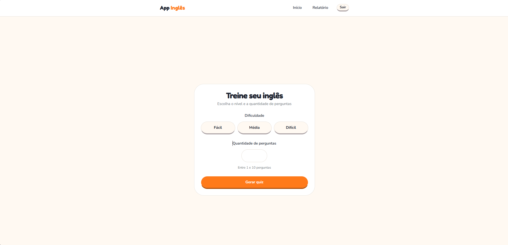
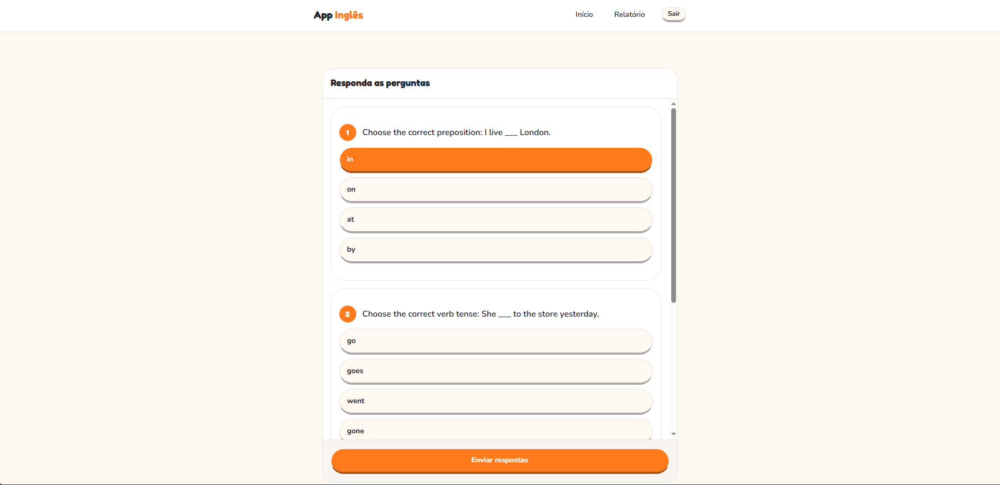
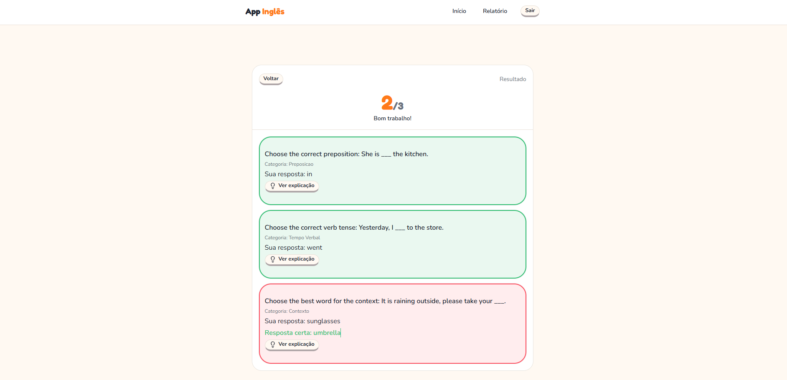
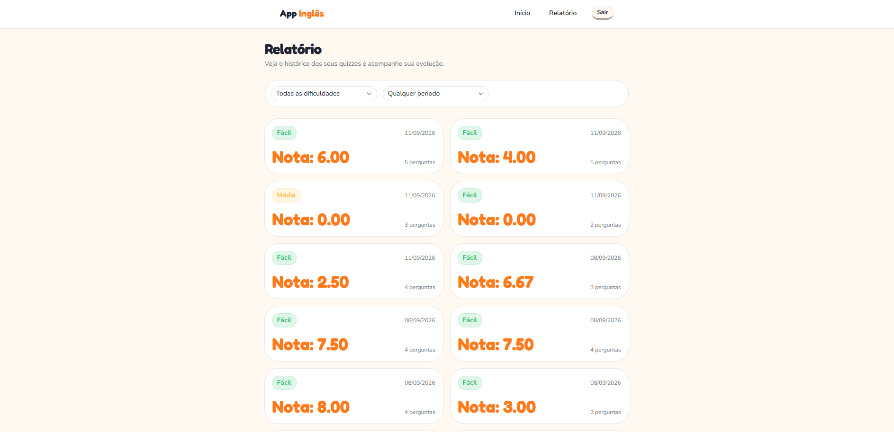

# App Inglês 🇬🇧

Treinador de inglês full-stack com quiz e feedback gerados por IA — a nota é sempre calculada no servidor, nunca confiada ao cliente.

🔗 Demo: https://app-ingles-bay.vercel.app/treino
📦 Repo: https://github.com/Americanoooo/app-ingles



---

## Problema / Motivação

Depois do primeiro projeto de portfólio, eu queria sair da minha zona de conforto num ponto específico: nunca tinha me aprofundado em consumir uma API externa de verdade. IA generativa encaixou perfeitamente nessa meta — dava pra construir algo útil (um treino de inglês) enquanto aprendia, de ponta a ponta, a integrar com um provedor de IA: da chamada ao modelo até validar e persistir com segurança o que ele devolve.

---

## ✨ Funcionalidades

- **Autenticação completa** — cadastro e login com senha criptografada e sessão via cookie httpOnly (proteção contra roubo de token via XSS).
- **Autorização por dono (anti-IDOR)** — cada usuário só vê os próprios quizzes; id de outro dono na URL não vaza dado (404 genérico, também anti-enumeração).
- **Geração de quiz por IA** — escolha de dificuldade e quantidade de perguntas; a IA gera questões de múltipla escolha nas categorias *preposição*, *tempo verbal* e *contexto*.

  

- **Correção automática** — a nota é calculada no servidor, com persistência atômica no banco.
- **Tela de resultado** — acertos destacados visualmente (verde/vermelho) com a resposta correta.

  

- **Histórico de quizzes** — relatório com filtros por dificuldade e período; revisão pergunta a pergunta de um quiz antigo.

  

---

## 🛠️ Tecnologias

**Front-end:** Next.js (App Router) · React · TypeScript · Tailwind CSS + shadcn/ui
**Back-end:** Next.js Route Handlers · MySQL (`mysql2`) · Zod · bcrypt · jose (JWT em cookie httpOnly)
**IA:** Google Gemini (endpoint compatível com OpenAI), saída estruturada via `json_schema`
**Infraestrutura:** Docker + Docker Compose · Deploy: Vercel (app) + Aiven (MySQL)

---

## 🧠 Destaques de arquitetura

**Saída estruturada da IA (`json_schema`).** Resposta de LLM em texto livre é inconsistente na prática — e isso não é só estética: um parse que falha vira bug real na experiência do usuário (quiz não carrega, feedback trava). Por isso a geração das perguntas e o feedback por pergunta usam saída estruturada (`json_schema`, na chamada compatível com OpenAI ao Gemini) — o schema trava os campos que a IA precisa devolver, então o código lê cada um com confiança em vez de tentar adivinhar texto solto. Como camada extra, a resposta ainda passa por validação com Zod antes de qualquer gravação no banco — defesa em profundidade: o schema garante o formato na saída do LLM, o Zod garante que o que chega no back-end bate com o que o banco espera, mesmo que o provedor mude de comportamento.

**Persistência atômica + injeção de dependência no model.** Quiz e perguntas precisam ser gravados como uma unidade: se a inserção de uma pergunta falhar no meio do caminho, sobra um quiz órfão (dado incompleto) no banco. Por isso `salvarQuizCompleto` abre uma transaction (`beginTransaction` → inserts → `commit`, com `rollback` no catch) garantindo tudo-ou-nada. O detalhe que faz isso funcionar: as funções do model recebem `db: Pool | PoolConnection` como parâmetro em vez de usar o `pool` global direto — porque todos os inserts da transação precisam rodar na **mesma conexão** (se cada um pegasse uma conexão qualquer do pool, o rollback de uma não teria efeito nenhum sobre o que já rodou em outra). A mesma função de insert roda tanto dentro da transação (recebendo a `PoolConnection` aberta) quanto avulsa (recebendo o `pool`), sem duplicar código.

**Trade-off consciente (v1): o gabarito ainda trafega pelo cliente.** O quiz gerado só é salvo no banco quando o usuário responde (é aí que existem nota e respostas pra gravar) — então `/api/responder` recebe a resposta certa de cada pergunta no mesmo body que o cliente reenvia. O servidor ainda é quem calcula a nota (o cliente não manda `acertou: true` diretamente), mas hoje não existe uma fonte de verdade independente do gabarito: em teoria, alguém no DevTools poderia editar o body antes de enviar e forçar 10/10. Fechar essa lacuna de vez é persistir o quiz no momento da geração e o `/api/responder` buscar o gabarito por `quizId` em vez de aceitá-lo no body (ver Roadmap).

---

## 🚀 Como rodar

### Opção 1 — Docker (recomendado)

**Pré-requisitos:** Docker instalado.

```bash
git clone https://github.com/Americanoooo/app-ingles.git
cd app-ingles
# crie o .env (veja "Variáveis de ambiente")
docker compose up --build
```

Acesse http://localhost:3000 — o schema do banco é criado automaticamente na primeira execução.

### Opção 2 — Local

**Pré-requisitos:** Node.js, MySQL local com o schema criado (`schema.sql`).

```bash
npm install
# configure o .env apontando pro seu MySQL local
npm run dev
```

## 🔑 Variáveis de ambiente

```env
DB_HOST=localhost          # use "db" ao rodar via Docker Compose
DB_USER=root
DB_PASSWORD=sua_senha
DB_NAME=app_ingles
DB_PORT=3306
JWT_SECRET=uma_chave_secreta_longa
GEMINI_API_KEY=sua_chave_do_gemini
```

> O `.env` está no `.gitignore` e não é versionado. A chave do Gemini é gratuita no Google AI Studio.

---

## 📁 Estrutura

```
app/
├── (auth)/          # login/cadastro (público)
├── (app)/           # treino, relatório (autenticado) + layout com Navbar
├── api/              # route handlers
components/
├── ui/               # shadcn/ui
lib/                  # models, conexão com o banco, helpers
schema.sql            # estrutura do banco
docker-compose.yml
dockerfile
```

---

## 🗺️ Roadmap

- **Modo adaptativo** — gerar perguntas focadas nas categorias que o usuário mais erra, lendo o histórico de acertos.
- **Fechar a lacuna do gabarito** — persistir o quiz no momento da geração e validar a resposta contra o banco (`quizId`), não contra o que o cliente reenvia.

---

## Autor

**Cauã Americano** — [GitHub](https://github.com/Americanoooo) · [LinkedIn](https://www.linkedin.com/in/cau%C3%A3-americano-19a4012a5/)

---

## English summary

Full-stack English trainer with AI-generated quizzes and per-question feedback (Next.js App Router, TypeScript, MySQL). The server is the source of truth for scoring — the client never decides the result. Questions and feedback come from Google Gemini (OpenAI-compatible endpoint) using structured output (`json_schema`), validated again with Zod before reaching the database. Quiz and questions are persisted atomically inside a single DB transaction, with dependency injection (`Pool | PoolConnection`) so the same model functions run standalone or inside the transaction. Session auth via httpOnly cookie (`jose`); ownership-based authorization prevents IDOR across users' quiz history.

Demo: https://app-ingles-bay.vercel.app/treino · Repo: github.com/Americanoooo/app-ingles
